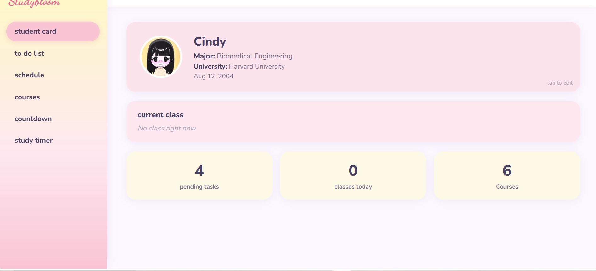
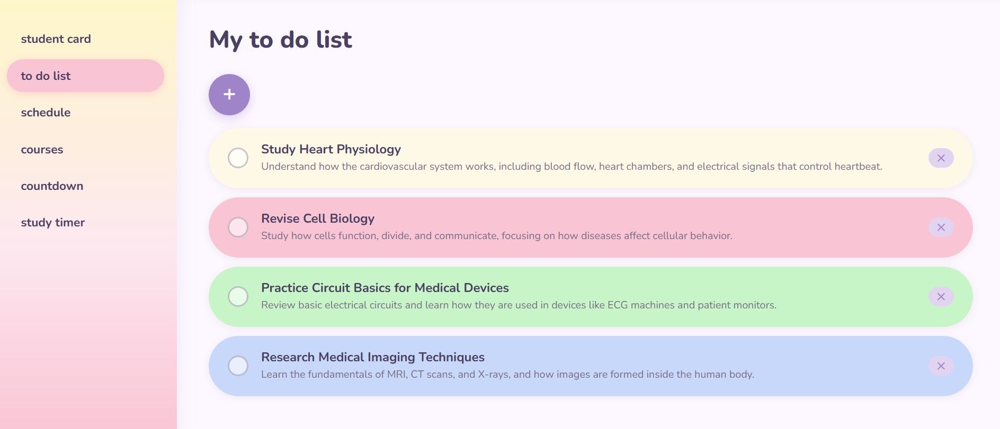
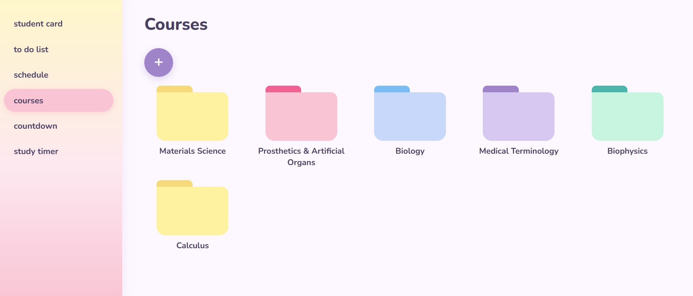
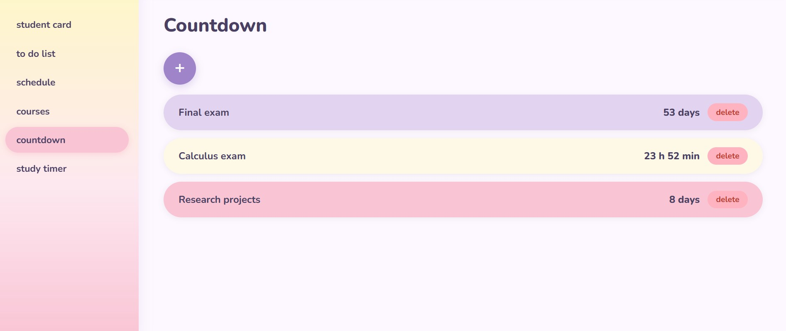
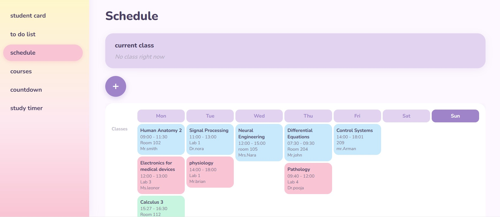
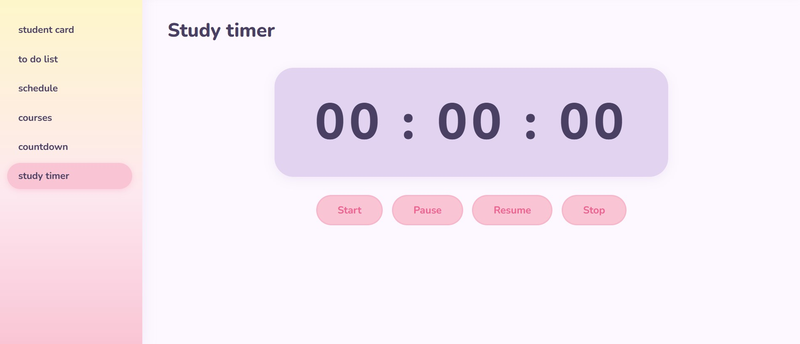

#  StudyBloom

StudyBloom is a cute pastel-themed student planner designed to help students stay organized and productive.
With a cozy and aesthetic interface, StudyBloom combines multiple academic tools in one place, including a customizable student card, task manager, course library, countdown timers, and class scheduler.

##  Features

###  Digital Student Card
- Upload a profile picture
- Customize card color
- Add:
  - Name
  - Major
  - School/University
  - Birthday
- Save information locally
  
  
  

###  To-Do List
- Create tasks
- Add descriptions
- Optional deadlines
- Mark tasks as completed
- Delete tasks
- Save progress automatically

  
  

###  Course Library
- Add courses
- Upload PDF lesson files
- Organize study materials
- Manage and delete courses

  

###  Countdown Manager
- Create custom countdowns
- Track:
  - Final exams
  - Project deadlines
  - Important events
- Live countdown updates

  

###  Schedule Planner
- Create weekly class schedules
- Store:
  - Class name
  - Tutor name
  - Room location
  - Start time
  - End time
- Organize classes by day

  

  ###  Study-timer
  - start your timer
  - & start your study session

    

###  Local Storage
- Data remains available after refreshing the page
- Separate save functionality for each section

##  Design

StudyBloom uses:
- Pastel color palette
- Rounded UI elements
- Soft shadows
- Cute and student-friendly layout
- Responsive design for desktop and mobile devices

##  Built With

- HTML5
- CSS3
- JavaScript (Vanilla)
- Local Storage API

Made with love for students who love staying organized.
